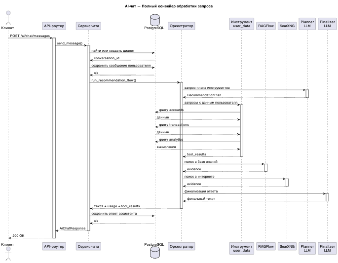
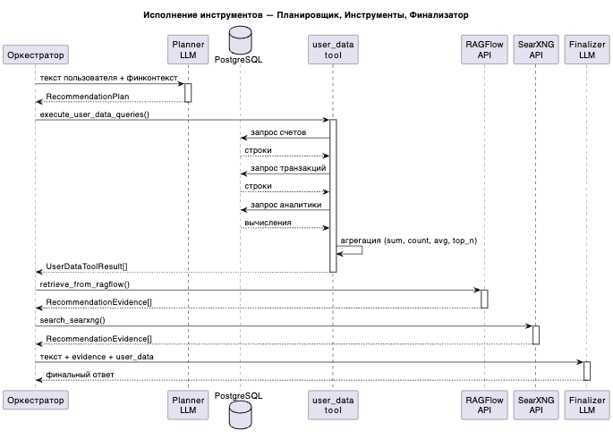
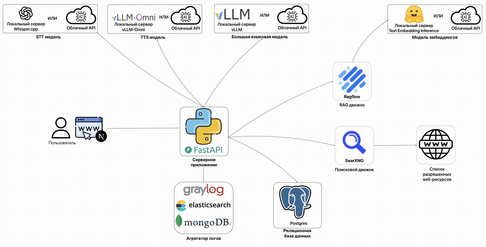
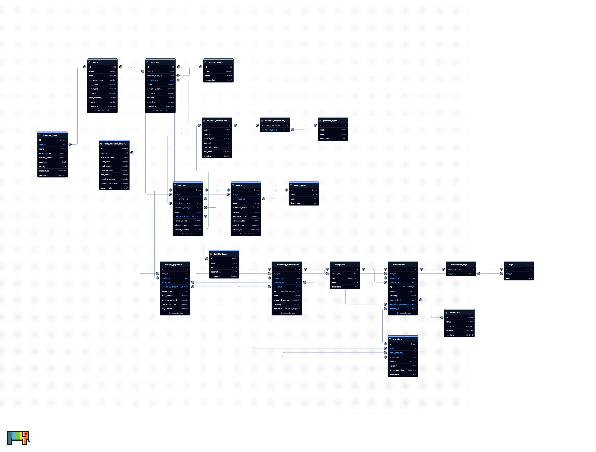

# ПрофИИт

ПрофИИт — умная ИТ-платформа для учёта личных финансов и персональных финансовых рекомендаций.

Приложение собирает финансовую картину пользователя в единую модель: счета, операции, переводы, активы, обязательства, цели и регулярные платежи. На основе этих данных система показывает аналитику, помогает оценивать долговую нагрузку, планировать накопления и подбирать релевантные советы, программы господдержки, налоговые вычеты и партнёрские финансовые продукты.

**Для обеспечения релеватнтных рекомендаций используется RAG и веб-поиск по списку разрешенных источников**

## Содержание

- [Описание бизнес функционала](#описание-функционала)
  - [Учет личных финансов](#учет-личных-финансов)
  - [AI-чат с голосовым режимом](#ai-чат-c-голосовым-режимом)
  - [Коммерческие и некоммерческие рекомендации для пользователей](#рекомендации)
- [Архитектура системы](#архитектура-системы)
  - [Высокоуровневая схема](#высокоуровневая-схема)
  - [API контракт](#api)
  - [Диаграммы последовательности для основных процессов](#диаграммы-последовательности-для-основных-процессов)
  - [База данных](#база-данных)
  - [Дальнейшее развитие](#дальнейшее-развитие)
- [Деплой системы](#деплой-системы)
- [Структура репозитория](#структура-репозитория)
  - [Документация](#документация)
  - [Текущий статус](#текущий-статус)
- [Тестирование системы](#тестирование)

## Описание функционала

### Учет личных финансов

ПрофИИт хранит реальные движения денег как транзакции, а остальные сущности описывают контекст этих движений. Такой подход позволяет одновременно вести операционный учёт, строить аналитику и безопасно передавать агрегированный финансовый контекст в AI-сценарии.

Основные возможности:

- учёт банковских счетов, карт, наличных, брокерских счетов, криптокошельков и других мест хранения денег;
- ведение доходов, расходов и переводов между своими счетами;
- учёт регулярных операций: зарплаты, аренды, подписок, платежей по долгам;
- учёт активов: недвижимости, автомобилей, инвестиций, бизнеса, криптоактивов и другого имущества;
- учёт обязательств: кредитов, ипотеки, кредитных карт, рассрочек, налоговых и неформальных долгов;
- связывание платежей по обязательствам с реальными транзакциями и разделение платежа на тело долга, проценты и комиссии;
- постановка финансовых целей и отслеживание прогресса;
- пользовательские теги, категории, merchants и финансовые организации для нормализации данных;
- ежедневные аналитические снимки: кэш, активы, обязательства, чистый капитал, доходы, расходы и savings rate.

Подробное описание доменной модели: [`db/descriptions.md`](db/descriptions.md).

### AI-чат c голосовым режимом

Встроенный AI-чат работает как финансовый ассистент. Пользователь может отправить текстовое или голосовое сообщение, а backend сохранит диалог, соберёт доступный финансовый контекст и вернёт ответ в текстовом виде, аудиоформате или в обоих форматах.

Ассистент может использовать:

1. Финансовые данные пользователя: счета, операции, активы, обязательства, цели, аналитику и долговую нагрузку.
2. Базу знаний с программами господдержки, субсидиями, налоговыми вычетами и финансовыми материалами.
3. Партнёрские или внешние финансовые предложения, если они доступны в разрешённых источниках.

Текстовый режим использует endpoint `POST /api/v1/ai/chat/messages`. Голосовой режим использует `POST /api/v1/ai/chat/audio`: аудио проходит через STT, затем текст обрабатывается LLM, после чего при необходимости ответ озвучивается через TTS. Провайдеры STT/LLM/TTS настраиваются через OpenAI-compatible API: это может быть облачный endpoint или локальная инфраструктура.

Для пунктов 2 и 3 используется recommendation pipeline: Planner LLM решает, нужны ли RAG или поиск, backend вызывает только разрешённые инструменты, а Finalizer LLM формирует итоговый ответ на основе найденных evidence. RAG работает через [`ragflow/`](ragflow/), поиск — через [`searxng/`](searxng/), embeddings — через [`tei/`](tei/). Разрешённые внешние источники перечислены в [`ragflow/allowed_resources.txt`](ragflow/allowed_resources.txt).



Исходник sequence-диаграммы: [`diagrams/ai-chat-full-pipeline.puml`](diagrams/ai-chat-full-pipeline.puml). Эксперименты с STT/TTS и аудиомоделями находятся в [`voice-test/`](voice-test/), локальный STT-сервер — в [`whisper-server/`](whisper-server/).

Подробнее: [`backend/docs/ai-chat.md`](backend/docs/ai-chat.md).

### Рекомендации

Рекомендационный контур используется в AI-чате и в отдельном продуктовом endpoint `POST /api/v1/recommendations?type=...`. Он нужен для сценариев, где ответ должен учитывать не только данные пользователя, но и проверяемые документы или разрешённые внешние источники.

Поддерживаемые типы рекомендаций:

- `income` — анализ доходов и советы по усилению доходной части;
- `expenses` — анализ расходов и рекомендации по оптимизации;
- `debt_traffic_light` — кредитный светофор и оценка долговой нагрузки;
- `credit_decision` — оценка конкретного кредита с учётом суммы, срока, платежа, ставки и цели;
- `about_me` — общий финансовый портрет пользователя;
- `savings_goal` — зарезервированный сценарий для анализа конкретной цели накопления.

Поток обработки:

1. Product service или AI-chat service формирует вопрос, тип рекомендации и финансовый контекст.
2. Planner LLM возвращает строгий JSON-план с нужными инструментами.
3. Backend выполняет только разрешённые tools: user-scoped SQL-запросы, RAGFlow retrieval и SearXNG search.
4. Search-результаты фильтруются через allowlist из [`ragflow/allowed_resources.txt`](ragflow/allowed_resources.txt).
5. Finalizer LLM формирует русскоязычный ответ с фактами, анализом, советом, статусом и evidence.
6. API возвращает нормализованный ответ для UI и `toolResults` для проверяемости.



Исходник sequence-диаграммы: [`diagrams/agentic-tool-execution.puml`](diagrams/agentic-tool-execution.puml).

Подробнее: [`backend/docs/recommendations.md`](backend/docs/recommendations.md), примеры ответов: [`backend/docs/recommendation_examples.md`](backend/docs/recommendation_examples.md).

## Архитектура системы

### Высокоуровневая схема



Центральный компонент системы — FastAPI backend. Он обслуживает клиентский API, управляет транзакциями, обращается к PostgreSQL, оркестрирует AI/voice/recommendation-сценарии и скрывает от frontend все секреты внешних сервисов.

Основные компоненты:

- [`frontend/`](frontend/) — Next.js-приложение для пользовательского интерфейса.
- [`backend/`](backend/) — FastAPI API, сервисный слой, репозитории, AI/recommendation orchestration.
- [`db/`](db/) — DBML-схема, описание модели, локальный PostgreSQL и инструкции по БД.
- [`api-contract/`](api-contract/) — OpenAPI-контракт клиентского API.
- [`ragflow/`](ragflow/) — self-hosted RAG-сервис для retrieval по базе знаний.
- [`searxng/`](searxng/) — self-hosted поисковый сервис для discovery по разрешённым ресурсам.
- [`tei/`](tei/) — локальный Text Embeddings Inference server для embeddings.
- [`vLLM/`](vLLM/) — локальный LLM inference для fully local AI-сценариев.
- [`whisper-server/`](whisper-server/) — локальный STT-сервер.
- [`graylog/`](graylog/) — агрегатор логов для наблюдаемости.

Backend-слои:

- `api/routes` — HTTP endpoints, валидация входа/выхода, OpenAPI-совместимые схемы;
- `services` — сценарии приложения и транзакционные границы;
- `repositories` — явный SQL и отображение строк БД в Python-структуры;
- `db` — пул подключений, транзакционные помощники, SQL-запросы;
- `clients` — адаптеры внешних и OpenAI-compatible провайдеров;
- `services/recommendations` — planner -> tools -> finalizer pipeline.

### API

Клиентский контракт: [`api-contract/openapi.yaml`](api-contract/openapi.yaml).

Основные группы endpoints:

- Auth и профиль: регистрация, логин, refresh, logout, текущий пользователь.
- Reference data: типы счетов, активов, долгов, категории, merchants, institutions.
- CRUD пользовательских объектов: accounts, transactions, transfers, recurring transactions, assets, liabilities, liability payments, goals, tags.
- Imports: идемпотентный импорт операций.
- Analytics: dashboard, cash-flow, net-worth, daily snapshots.
- AI Chat: текстовый чат, голосовой чат, диалоги и сообщения.
- Recommendations: единый продуктовый endpoint `POST /api/v1/recommendations?type=...`.

Auth работает через Bearer JWT и серверные сессии в `auth_sessions`. Все пользовательские финансовые запросы выполняются с фильтрацией по текущему пользователю; чужие UUID должны возвращать `404`, а не раскрывать факт существования ресурса.

### Диаграммы последовательности для основных процессов

В [`diagrams/`](diagrams/) находятся PNG и PlantUML-исходники, а в [`docs/architecture-uml.md`](docs/architecture-uml.md) — Mermaid-версии основных сценариев.

Ключевые диаграммы:

- [`diagrams/system_design.png`](diagrams/system_design.png) — компонентная архитектура системы.
- [`diagrams/functionality.png`](diagrams/functionality.png) — карта продуктовых возможностей.
- [`diagrams/ERD.png`](diagrams/ERD.png) — entity-relationship диаграмма базы данных.
- [`diagrams/ai-chat-full-pipeline.png`](diagrams/ai-chat-full-pipeline.png) — полный AI-chat pipeline.
- [`diagrams/agentic-tool-execution.png`](diagrams/agentic-tool-execution.png) — исполнение recommendation tools.
- [`docs/ai-chat-flow.puml`](docs/ai-chat-flow.puml) — дополнительный PlantUML flow AI-чата.

### База данных



Схема описана в двух формах:

- [`db/schema.dbml`](db/schema.dbml) — компактная DBML-схема для визуализации.
- [`backend/migrations/versions/`](backend/migrations/versions/) — исполняемая история изменений через Alembic.

Ключевые принципы:

- реальные движения денег хранятся в `transactions`;
- `transfers` связывает две transaction legs: списание и зачисление;
- `recurring_transactions` хранит шаблоны, но не заменяет фактические операции;
- `assets` и `liabilities` участвуют в расчёте чистого капитала;
- `liability_payments` связывает платежи по долгам с реальными транзакциями;
- `daily_financial_snapshots` — производная read model для графиков, отчётов и AI-аналитики;
- изменения структуры БД должны попадать и в Alembic-миграции, и в `db/schema.dbml`.

Подробное описание таблиц: [`db/descriptions.md`](db/descriptions.md). Локальный PostgreSQL, backup и restore: [`db/deployment.md`](db/deployment.md).

### Дальнейшее развитие

Ближайшие направления развития:

- сделать архитектуру более async-friendly для повышения проивзодительности
- проработать систему с точки зрения безопасности и сохранности данных (backup политики и.т.п)
- довести клиентские dashboard flows и формы ввода финансовых данных;
- реализовать фоновые пересчёты `daily_financial_snapshots`;
- расширить импорт операций из банковских выписок и внешних интеграций;
- добавить сценарии по конкретным целям накопления;
- подготовить production deployment manifests и секреты для управляемой инфраструктуры;
- расширить наблюдаемость: метрики AI-вызовов, latency, tool usage, качество retrieval и ошибки провайдеров.

Ключевые инженерные решения уже зафиксированы в [`backend/STACK.md`](backend/STACK.md): Python 3.12+, FastAPI, Pydantic v2, PostgreSQL, Alembic, явный SQL без ORM для прикладной персистентности, транзакции на уровне service/use-case.

## Деплой системы

Корневой [`Makefile`](Makefile) управляет всеми основными режимами запуска: локальное ядро, локальные рекомендации, fully local AI, гибридный режим и cloud/external AI endpoints.

Базовые команды:

```bash
make help
make doctor
make init
```

Основные профили:

| Сценарий | Что запускает | Команда |
| --- | --- | --- |
| Локальное ядро | PostgreSQL + backend + frontend в Docker | `make deploy-system ENTITY=core DEPLOYMENT=local` |
| Локальные рекомендации | TEI + RAGFlow + SearXNG локально | `make deploy-system ENTITY=recommendations DEPLOYMENT=local` |
| Fully local AI | Core + vLLM + TEI/RAGFlow/SearXNG локально | `make deploy-system ENTITY=ai DEPLOYMENT=local` |
| Hybrid AI | Cloud/external LLM + локальные RAG/search/embeddings | `make deploy-system ENTITY=ai DEPLOYMENT=hybrid` |
| Cloud AI | Core cloud-проверка + внешние AI/RAG endpoints | `make deploy-system ENTITY=ai DEPLOYMENT=cloud` |
| Полная система | Core + рекомендации локально | `make deploy-system ENTITY=system DEPLOYMENT=local` |
| Full local demo | vLLM, TEI, RAGFlow, SearXNG, Graylog, PostgreSQL, backend, frontend | `make deploy-system ENTITY=full DEPLOYMENT=local` |

Совместимые алиасы: `make deploy-local-core`, `make deploy-local-ai`, `make deploy-hybrid-llm-local-rag`, `make deploy-cloud-ai`, `make deploy-full-local`.

Локальная разработка приложения:

```bash
make deploy-system ENTITY=core DEPLOYMENT=local   # PostgreSQL + backend + frontend
make backend-run                                     # FastAPI dev server (порт 8000)
make frontend-install                                # npm install
make frontend-run                                    # Next.js dev server (порт 3000)
```

Локальные recommendation-сервисы:

```bash
make deploy-system ENTITY=recommendations DEPLOYMENT=local
make recommendations-test
```

Fully local AI:

```bash
make init
make pull-ai-local
make deploy-system ENTITY=ai DEPLOYMENT=local
```

Остановка:

```bash
make local-down
make deploy-down
```

Перед включением рекомендаций backend должен получить обязательные env-переменные:

```env
RECOMMENDATIONS_ENABLED=true
RAGFLOW_BASE_URL=http://localhost:9380
RAGFLOW_API_KEY=...
RAGFLOW_DATASET_ID=...
SEARXNG_BASE_URL=http://localhost:8201
```

Для backend в Docker локальные сервисы хоста обычно указываются через `host.docker.internal`.

Подробные профили, production safety gate и env-примеры: [`docs/deployment.md`](docs/deployment.md).
## Структура репозитория

```text
.
├── api-contract/          # OpenAPI/Swagger YAML
├── backend/               # Python/FastAPI backend, Alembic-миграции
├── db/                    # DBML-схема, описание модели, локальный PostgreSQL
├── diagrams/              # Визуальные схемы (PNG + PlantUML)
├── docs/                  # Проектная документация
├── frontend/              # Next.js фронтенд
├── graylog/               # Агрегатор логов
├── ragflow/               # Self-hosted RAG-сервис
├── scripts/               # Служебные скрипты
├── searxng/               # Self-hosted поисковый сервис
├── tei/                   # Локальный embedding inference
├── vLLM/                  # Локальный LLM inference
├── voice-test/            # Прототипы голосового ввода/вывода
├── whisper-server/        # Локальный STT-сервер
├── docker-compose.yml     # Основной compose-файл
├── Makefile               # Корневые команды деплоя
└── render.yaml            # Конфигурация облачного деплоя
```

### Документация

| Документ | Содержание |
| --- | --- |
| [`api-contract/openapi.yaml`](api-contract/openapi.yaml) | Полный клиентский OpenAPI/Swagger-контракт |
| [`backend/STACK.md`](backend/STACK.md) | Backend-стек, правила транзакций, SQL-подход, тестирование |
| [`backend/TESTING.md`](backend/TESTING.md) | Test gate, fixtures, cross-user authorization |
| [`backend/docs/ai-chat.md`](backend/docs/ai-chat.md) | AI-чат: архитектура, STT/LLM/TTS, голосовой режим |
| [`backend/docs/recommendations.md`](backend/docs/recommendations.md) | Recommendation planner/RAG/search архитектура |
| [`backend/docs/recommendation_examples.md`](backend/docs/recommendation_examples.md) | Примеры planner JSON и финальных ответов |
| [`backend/docs/ragflow_dataset_setup.md`](backend/docs/ragflow_dataset_setup.md) | Настройка RAGFlow dataset и TEI embedding |
| [`backend/migrations/README.md`](backend/migrations/README.md) | Контекст по миграциям |
| [`db/schema.dbml`](db/schema.dbml) | DBML-схема таблиц, enum, индексов и связей |
| [`db/descriptions.md`](db/descriptions.md) | Подробное описание доменной модели |
| [`db/deployment.md`](db/deployment.md) | Локальный PostgreSQL, backup/restore |
| [`docs/architecture-uml.md`](docs/architecture-uml.md) | UML/Mermaid диаграммы и deployment-комбинации |
| [`docs/deployment.md`](docs/deployment.md) | Профили деплоя: local, hybrid, fully local AI, cloud |
| [`docs/hackathon-readiness.md`](docs/hackathon-readiness.md) | План демо, проверки, границы системы |


## Тестирование

Backend тестируется как интеграционный API-сервис: FastAPI вызывается через `httpx`, а данные пишутся в реальную PostgreSQL test DB. Это проверяет миграции, SQL, авторизацию, OpenAPI parity и user isolation.

Быстрый backend gate:

```bash
make backend-lint
make backend-compile
make backend-test
```

То же из директории backend:

```bash
cd backend
make test
```

Recommendation/AI checks:

```bash
make backend-test-recommendations
make recommendations-test
make recommendations-smoke
make recommendations-curl
```

Frontend checks:

```bash
cd frontend
npm audit --audit-level=moderate
npm run build
```

Проверяемые сценарии:

- регистрация, логин, refresh, logout;
- CRUD счетов, операций, переводов, активов, обязательств, целей и тегов;
- атомарность переводов через `transfer + debit transaction + credit transaction`;
- платежи по обязательствам и связь с транзакциями;
- dashboard, cash-flow, net-worth и snapshots;
- AI chat, диалоги, текстовый и голосовой сценарии;
- recommendation planner/tools/finalizer;
- фильтрация поиска по [`ragflow/allowed_resources.txt`](ragflow/allowed_resources.txt);
- OpenAPI parity между FastAPI routes и [`api-contract/openapi.yaml`](api-contract/openapi.yaml);
- cross-user authorization: чужие ресурсы возвращают `404`.

Подробнее: [`backend/TESTING.md`](backend/TESTING.md), готовность к демо: [`docs/hackathon-readiness.md`](docs/hackathon-readiness.md).
