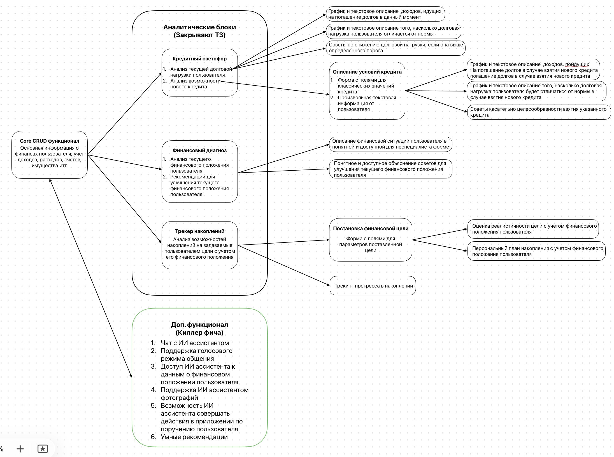

# ПрофИИт

ПрофИИт — умная ИТ-платформа для учёта личных финансов.

## Содержание

- [Описание функционала](#описание-функционала)
  - [Учет личных финансов](#api)
  - [AI-чат с голосовым режимом](#ai-чат-и-голосовой-режим)
  - [Коммерческие и некоммерческие рекомендации для пользователей](#рекомендации-rag-и-поиск)
- [Архитектура системы](#архитектура-системы)
  - [Высокоуровневая схема](#высокоуровневая-схема)
  - [API контракт](#api)
  - [Диаграммы последовательности для основных процессов](#диаграммы)
  - [База данных](#база-данных)
  - [Дальнейшее развитие](#дальнейшее-развитие)
- [Деплой системы](#деплой-системы)
- [Тестирование системы](#деплой-системы)
- [Структура репозитория](#структура-репозитория)
  - [Документация](#документация)
  - [Текущий статус](#текущий-статус)

## Описание функционала

Цель системы — собрать личные финансовые данные пользователя в единую модель и дать понятную аналитику: движение денег, чистый капитал, долговую нагрузку, регулярные платежи, цели и рекомендации. Главный принцип: реальные движения денег хранятся в `transactions`, а счета, активы, долги, категории, теги и регулярные операции описывают контекст этих движений.

### Доменная модель

**Пользователь и справочники.** `users` хранит учётную запись, валюту по умолчанию, таймзону. Клиентский API не отдаёт `password_hash` — для этого отдельный auth-контур. Справочные таблицы задают стабильную классификацию: `account_types`, `asset_types`, `liability_types`, `provider_types`, `financial_institutions`, `categories`, `merchants`.

**Счета и операции.** `accounts` описывает места хранения денег: банковские счета, карты, наличные, инвестиционные счета и кошельки. `transactions` — главный денежный журнал: доходы, расходы и legs переводов.

**Переводы.** `transfers` — бизнес-сущность перевода между счетами, связанная с двумя строками `transactions`: `debit` (списание с источника) и `credit` (зачисление на получатель). Ограничения БД гарантируют `type = transfer` и не более одного leg каждого типа на перевод.

**Регулярные операции.** `recurring_transactions` хранит шаблоны ожидаемых платежей и поступлений (зарплата, аренда, подписки, платежи по долгам). Это не реальные операции — фактическое движение денег всё равно в `transactions`.

**Активы и обязательства.** `assets` — имущество пользователя (недвижимость, авто, портфель, бизнес, криптоактивы). `liabilities` — долги и обязательства (кредиты, ипотека, кредитные карты, рассрочки). `liability_payments` связывает реальный платёж из `transactions` с долгом, раскладывая его на тело долга, проценты и комиссии.

**Цели, теги, аналитика.** `financial_goals` — цели по накоплению, закрытию долга, покупке актива. `tags` и `transaction_tags` — пользовательская разметка операций. `daily_financial_snapshots` — ежедневные агрегаты (кэш, активы, обязательства, чистый капитал, доход/расход, savings rate) — read model для графиков, отчётов и AI-аналитики.

Подробнее: [`db/descriptions.md`](db/descriptions.md).

### API

Клиентский контракт: [`api-contract/openapi.yaml`](api-contract/openapi.yaml).

Основные группы endpoints:
- Auth и профиль: регистрация, логин, текущий пользователь.
- Reference data: типы счетов, активов, долгов, категории, merchants, institutions.
- CRUD пользовательских объектов: accounts, transactions, transfers, recurring transactions, assets, liabilities, liability payments, goals, tags.
- Imports: идемпотентный импорт операций.
- Analytics: dashboard, cash-flow, net-worth, daily snapshots.
- AI Chat: текстовый и голосовой чат.
- Recommendations: единый продуктовый endpoint `POST /api/v1/recommendations?type=...` для доходов, расходов, кредитного светофора, оценки конкретного кредита и общего финансового портрета.

### AI-чат и голосовой режим

OpenAPI-контракт предусматривает AI chat endpoints:
- отправка текста;
- отправка аудио;
- получение текста;
- получение аудио;
- получение аудио вместе с текстом/транскриптом.

`voice-test/` содержит ранние эксперименты с записью, STT/TTS и аудиомоделями.

Подробнее: [`backend/docs/ai-chat.md`](backend/docs/ai-chat.md).

### Рекомендации, RAG и поиск

Рекомендационный контур — опциональный слой поверх AI-чата:
- Первый LLM-вызов возвращает строгий JSON-план с `response_text` и `needed_tools`.
- Backend выполняет только разрешённые инструменты: **RAGFlow** для retrieval из базы знаний и **SearXNG** для поиска.
- Источники поиска фильтруются через [`ragflow/allowed_resources.txt`](ragflow/allowed_resources.txt).
- Финальный LLM-вызов формирует ответ с учётом найденных evidence chunks.
- План и evidence возвращаются в `tool_results`.
- Продуктовый endpoint рекомендаций использует тот же pipeline, но нормализует ответ в поля `analysis`, `advice`, `status`, `facts`, `creditRatingImpact`, `freeCashAfterCredit` и другие поля, удобные для UI.

Локальные self-hosted сервисы: [`ragflow/`](ragflow/), [`searxng/`](searxng/), [`tei/`](tei/) (Hugging Face TEI embedding server для RAGFlow).

Подробнее: [`backend/docs/recommendations.md`](backend/docs/recommendations.md).

## Архитектура системы

### Высокоуровневая схема

```text
Фронтенд / мобильное приложение / голосовой интерфейс
        |
        | HTTP + OpenAPI contract
        v
FastAPI backend
        |
        | service/use-case layer
        v
Repositories with explicit SQL
        |
        v
PostgreSQL
```

Backend-слои:
- `api/routes` — HTTP-эндпоинты, валидация входа/выхода, OpenAPI-совместимые схемы.
- `services` — сценарии приложения и транзакционные границы.
- `repositories` — явный SQL и отображение строк БД в Python-структуры.
- `db` — пул подключений, транзакционные помощники, SQL-запросы.
- `workers` — фоновые задачи: пересчёт аналитики, импорты, AI/voice processing.

### Диаграммы

В [`diagrams/`](diagrams/) находятся визуальные схемы в форматах PNG и PlantUML (`.puml`). PUML-файлы можно редактировать и перерендеривать.

#### ERD — схема базы данных


Полная entity-relationship диаграмма PostgreSQL: таблицы пользователей, счетов, транзакций, переводов, активов, обязательств, целей, тегов и аналитики со всеми связями.

#### Карта возможностей



Продуктовая диаграмма: core CRUD, кредитный светофор, финансовый диагноз, трекер накоплений, AI-ассистент, голосовой режим и рекомендации.

#### Архитектура системы


Высокоуровневая компонентная схема: FastAPI backend, PostgreSQL, Graylog, LLM/STT/TTS-провайдеры, RAGFlow, SearXNG, TEI embeddings и связи между ними.

#### AI-чат — полный конвейер


Sequence-диаграмма полного цикла обработки AI-запроса: от клиента через API-роутер и сервис чата, planner/finalizer LLM, user data tool, RAGFlow и SearXNG до сохранения ответа. Исходник: [`ai-chat-full-pipeline.puml`](diagrams/ai-chat-full-pipeline.puml).

#### Исполнение инструментов рекомендаций


Sequence-диаграмма recommendation flow: Planner LLM генерирует JSON-план, оркестратор вызывает user_data tool (запросы к PostgreSQL), RAGFlow retrieval и SearXNG search, затем Finalizer LLM формирует финальный ответ. Исходник: [`agentic-tool-execution.puml`](diagrams/agentic-tool-execution.puml).

Подробные Mermaid-версии и deployment-комбинации: [`docs/architecture-uml.md`](docs/architecture-uml.md).

### База данных

Схема описана в двух формах:
- [`db/schema.dbml`](db/schema.dbml) — компактная DBML-схема для визуализации.
- [`backend/migrations/versions/`](backend/migrations/versions/) — исполняемая история изменений через Alembic.

Подробное описание таблиц: [`db/descriptions.md`](db/descriptions.md).

### Ключевые решения

- Backend: Python 3.12+, FastAPI, Pydantic v2.
- Database: PostgreSQL.
- Миграции: Alembic.
- Доступ к БД: `psycopg` и явный SQL, без ORM для прикладной персистентности.
- Транзакции на уровне service/use-case, не внутри repository.
- OpenAPI-контракт хранится отдельно — источник клиентского API-дизайна.
- Аналитические таблицы — производные данные, не источник истины.

## Деплой системы

### Корневой Makefile

```bash
make help
make doctor
make init
```

Основные сценарии:

```bash
# Только ядро: PostgreSQL + backend migrations
make init-core
make local-up-core

# Рекомендационный стек локально: TEI + RAGFlow + SearXNG
make init-recommendations
make pull-recommendations
make local-up-recommendations

# Локальный AI-стек: vLLM + TEI + RAGFlow + SearXNG
make pull-ai-local
make local-up-ai

# Проверка cloud/hybrid конфигурации
make cloud-check
make cloud-recommendations-check
```

### Локальный запуск

Файл `.env` в корне проекта:

```bash
POSTGRES_DB=findoctor
POSTGRES_USER=findoctor
POSTGRES_PASSWORD=change_me
POSTGRES_PORT=5433
```

```bash
cd backend
make db-up      # запуск локальной БД
make migrate    # применение миграций
make db-current # проверка текущей ревизии
```

Подробнее: [`db/deployment.md`](db/deployment.md), [`docs/deployment.md`](docs/deployment.md).

### Миграции

```bash
cd backend
make migration m="описание изменений"  # создать новую миграцию
make migrate                            # применить
```

Любое изменение структуры БД должно быть отражено в Alembic-миграции и в `db/schema.dbml`.

### Проверка перед демо

```bash
cd backend
.venv/bin/python -m compileall -q app tests scripts
.venv/bin/ruff check app tests scripts
.venv/bin/pytest tests/ -q

cd ../frontend
npm audit --audit-level=moderate
npm run build
```

Что проверяется: синтаксис backend-кода, Ruff-линтинг, integration suite на PostgreSQL test DB, совпадение route surface с контрактом, cross-user изоляция, frontend dependency scanner, production-сборка.

## Структура репозитория

```text
.
├── api-contract/          # OpenAPI/Swagger YAML
├── backend/               # Python/FastAPI backend, Alembic-миграции
├── db/                    # DBML-схема, описание модели, локальный PostgreSQL
├── diagrams/              # Визуальные схемы (PNG + PlantUML)
├── docs/                  # Проектная документация
├── frontend/              # Next.js фронтенд
├── graylog/               # Агрегатор логов
├── ragflow/               # Self-hosted RAG-сервис
├── scripts/               # Служебные скрипты
├── searxng/               # Self-hosted поисковый сервис
├── tei/                   # Локальный embedding inference
├── vLLM/                  # Локальный LLM inference
├── voice-test/            # Прототипы голосового ввода/вывода
├── whisper-server/        # Локальный STT-сервер
├── docker-compose.yml     # Основной compose-файл
├── Makefile               # Корневые команды деплоя
└── render.yaml            # Конфигурация облачного деплоя
```

### Документация

| Документ | Содержание |
| --- | --- |
| [`api-contract/openapi.yaml`](api-contract/openapi.yaml) | Полный клиентский OpenAPI/Swagger-контракт |
| [`backend/STACK.md`](backend/STACK.md) | Backend-стек, правила транзакций, SQL-подход, тестирование |
| [`backend/TESTING.md`](backend/TESTING.md) | Test gate, fixtures, cross-user authorization |
| [`backend/docs/ai-chat.md`](backend/docs/ai-chat.md) | AI-чат: архитектура, STT/LLM/TTS, голосовой режим |
| [`backend/docs/recommendations.md`](backend/docs/recommendations.md) | Recommendation planner/RAG/search архитектура |
| [`backend/docs/recommendation_examples.md`](backend/docs/recommendation_examples.md) | Примеры planner JSON и финальных ответов |
| [`backend/docs/ragflow_dataset_setup.md`](backend/docs/ragflow_dataset_setup.md) | Настройка RAGFlow dataset и TEI embedding |
| [`backend/migrations/README.md`](backend/migrations/README.md) | Контекст по миграциям |
| [`db/schema.dbml`](db/schema.dbml) | DBML-схема таблиц, enum, индексов и связей |
| [`db/descriptions.md`](db/descriptions.md) | Подробное описание доменной модели |
| [`db/deployment.md`](db/deployment.md) | Локальный PostgreSQL, backup/restore |
| [`docs/architecture-uml.md`](docs/architecture-uml.md) | UML/Mermaid диаграммы и deployment-комбинации |
| [`docs/deployment.md`](docs/deployment.md) | Профили деплоя: local, hybrid, fully local AI, cloud |
| [`docs/hackathon-readiness.md`](docs/hackathon-readiness.md) | План демо, проверки, границы системы |

### Текущий статус

Готово:
- Базовая схема PostgreSQL и Alembic-миграции.
- DBML-документация и OpenAPI-контракт клиентского API.
- Модель переводов через две связанные транзакции.
- FastAPI backend с основными API-группами.
- AI chat endpoints с текстовым и голосовым сценариями.
- Опциональный recommendation/RAG/search контур.
- User-scoped доступ к финансовым данным.
- Cross-user authorization тесты.
- Dependency scanner clean для frontend.
- Dockerfile для backend и frontend, root `docker-compose.yml`, Make-команды для всех профилей деплоя.
- UML/Mermaid sequence diagrams и локальные service wrappers для vLLM, RAGFlow, SearXNG, TEI, whisper-server.

Следующие шаги:
- Довести клиентский UX и dashboard flows.
- Реализовать фоновые пересчёты аналитических snapshots.
- Подготовить production deployment manifests.
