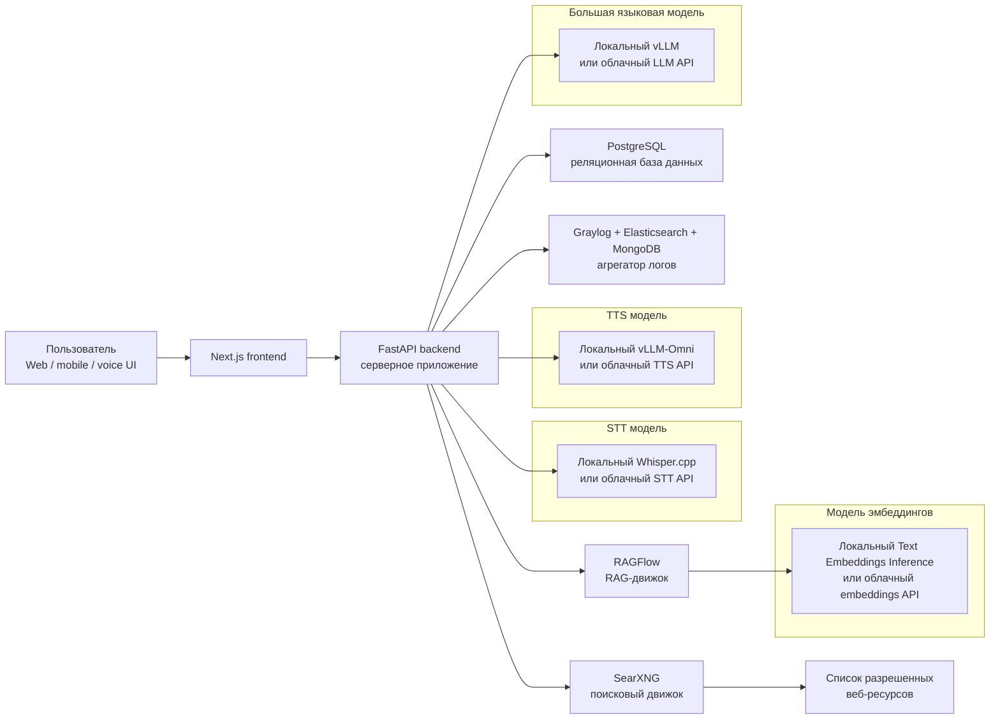
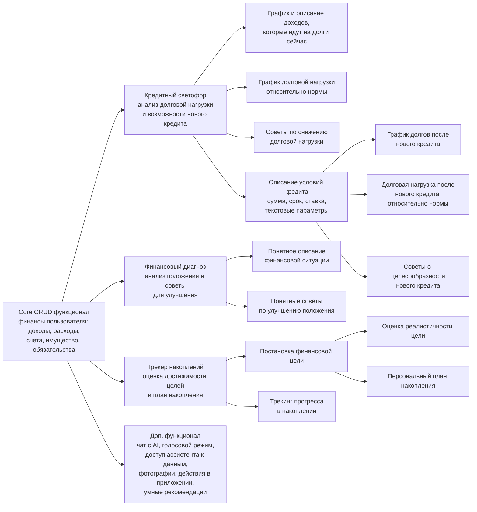
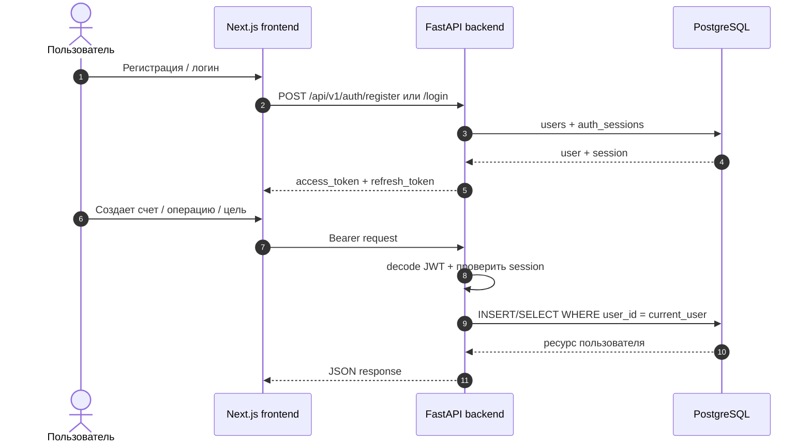
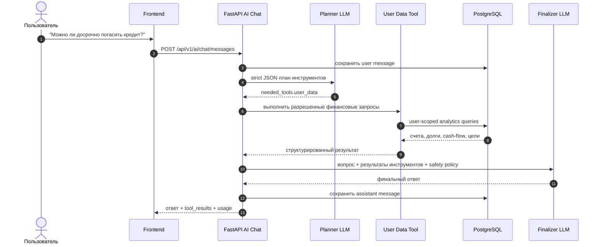
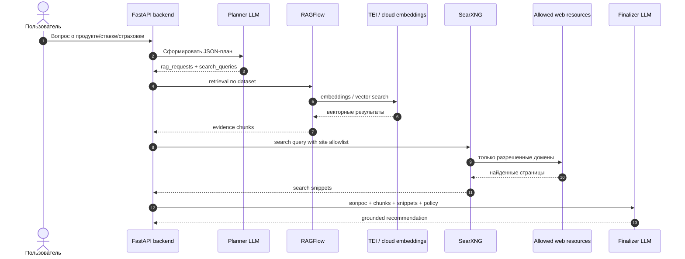
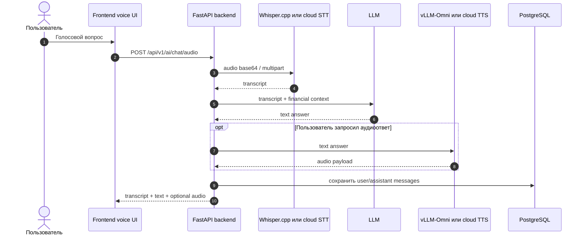
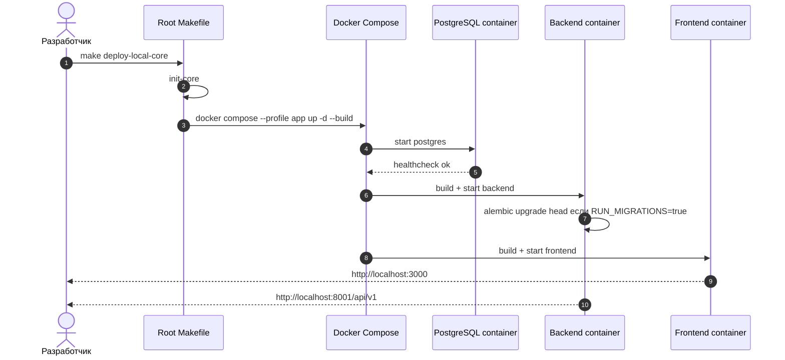

# Архитектура И UML-Сценарии ФинДоктора

Документ описывает высокоуровневую архитектуру, deployment-комбинации и основные sequence flows. Диаграммы написаны в Mermaid, чтобы их можно было смотреть прямо в GitHub/GitLab/Markdown-рендерах.

## Компонентная Карта

Диаграмма соответствует целевой схеме: FastAPI является центральным backend-узлом, а AI/STT/TTS/embeddings могут быть локальными или облачными.

## Продуктовая Карта Возможностей

## Sequence: Регистрация И Работа С Финансовыми Данными

## Sequence: Текстовый AI-Чат С User Data Tool

## Sequence: RAG/Search Рекомендация

## Sequence: Голосовой Режим

## Sequence: Docker Deployment Core

## Deployment-Комбинации

| Сценарий | LLM | STT | TTS | Embeddings | RAG/Search | Команда |
| --- | --- | --- | --- | --- | --- | --- |
| Core app | отключено/облако по env | облако по env | облако по env | нет | нет | `make deploy-local-core` |
| Local RAG | облако/external | облако/external | облако/external | локальный TEI | RAGFlow + SearXNG локально | `make deploy-local-rag` |
| Fully local AI | локальный vLLM | cloud/local по env | cloud/local по env | локальный TEI | RAGFlow + SearXNG локально | `make deploy-local-ai` |
| Hybrid LLM + local RAG | cloud/external LLM | cloud/external | cloud/external | локальный TEI | RAGFlow + SearXNG локально | `make deploy-hybrid-llm-local-rag` |
| Cloud AI/RAG | cloud/external | cloud/external | cloud/external | cloud/external | managed/internal endpoints | `make deploy-cloud-ai` |
| Full local demo | локальный vLLM | optional local/cloud | optional local/cloud | локальный TEI | RAGFlow + SearXNG + Graylog | `make deploy-full-local` |

## Принцип Безопасности

Frontend никогда не получает ключи RAGFlow, SearXNG, LLM, STT, TTS или embeddings. Все секреты находятся на backend side. Модель может предложить план инструментов, но выполнение остается в backend-коде с user-scoped SQL и allowlist источников.
